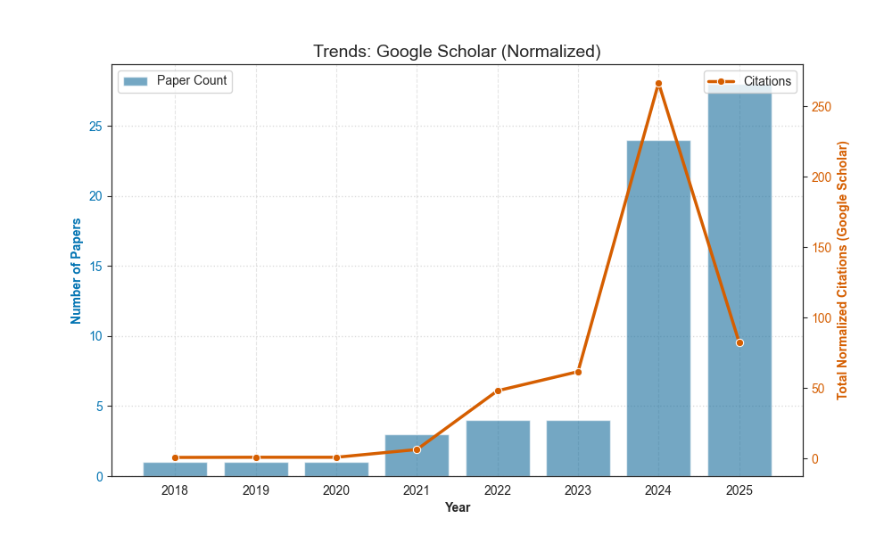
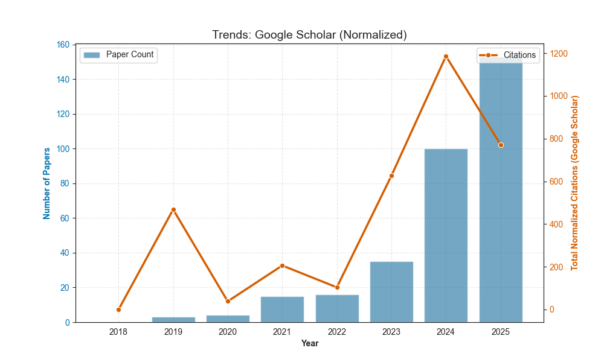
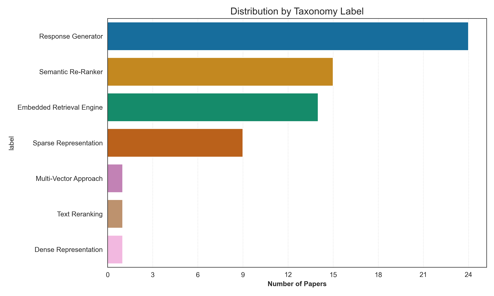
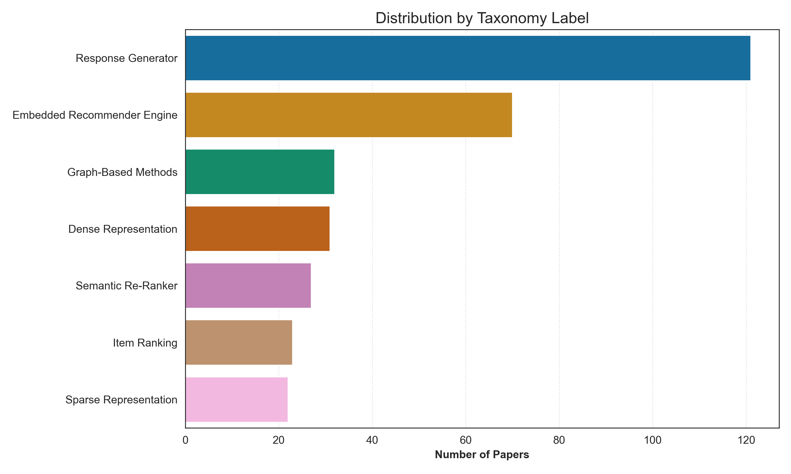

# Analysis of Publication Trends and Distributions

This directory contains the figures presented in our survey, which provide empirical evidence for the convergence of Information Retrieval (IR) and Recommender Systems (RS) in the era of Large Language Models (LLMs). Below, we offer a more detailed narrative and interpretation for each figure.

## Publication Volume and Normalized Citation Trends in IR and RS

This figure provides a temporal analysis of the research landscape, comparing the volume of publications with their evolving scholarly impact over time. It juxtaposes the absolute number of papers published each year (bars) with the aggregated, age-normalized citation score for those papers (lines). This dual view helps us understand not just when research was published, but also the lasting impact of the work from different periods.

  
  

*Note: c.f. Figure 4 of our survey.*

The bars represent the raw count of papers published in a given year. The lines represent the Normalized Citation Score, a metric designed to measure scholarly impact while mitigating the inherent advantage of older papers. The score for a given year is the sum of the normalized scores of all papers published in that year. The formula is detailed [here](../README.md#normalized-citation-score).

### Key Insights and Interpretation

The data reveals a compelling *tri-partite* era in the adoption and impact of LLM-centric approaches, with both fields following a remarkably similar trajectory, albeit with RS often anticipating trends by approximately a year.

**The Foundational Era (Pre-2021)**: In this early period, the number of publications in both IR and RS was relatively low, representing the nascent exploration of the paradigm. A key observation is the significant peak in the normalized citation score for RS papers from *2019*. This indicates that this year was particularly beneficial for producing foundational works in the recommender systems domain. These early papers, while few in number, have had a lasting and significant impact, a trend that is even more pronounced in the raw citation data available in the [/supplement](../supplement) directory.

**The Acceleration Era (2021-2023)**: This period marks a clear acceleration in the number of papers being published in both fields, signaling a growing interest and validation of the LLM-based approach. The scale of the bars confirms a quantitatively larger research output in the RS community compared to IR. During these years, the normalized citation scores for RS papers begin a steep ascent, demonstrating that the work from this period was quickly recognized as impactful. In contrast, the citation impact for IR papers remained relatively low, preceding a dramatic increase in the subsequent period. This suggests that the RS community anticipated the wave of high-impact research by about a year.

**The *Consecration* Era (2024-Present)**: The years *2024* and *2025* represent the most prosperous period for both fields. Publication volume reaches its peak, confirming that LLM-centric solutions have become the mainstream, dominant paradigm. Both IR and RS show a dramatic spike in their normalized citation scores. This synchronized peak consecrates the modern LLM era, demonstrating that the most recent work in both communities is seen as highly valuable and is attracting immediate and significant scholarly attention.

## Distribution of Publications Across Taxonomy Subtopics

This figure presents a static snapshot of the total research output, distributed across the taxonomy categories for both IR and RS. The bar plots allow for a direct comparison of where the research community has invested its efforts, revealing a clear story of historical divergence and modern convergence.

  
  

*Note: c.f. Figure 7 of our survey.*

The key insight from this figure is a story of convergence. While the pre-GPT era shows the two fields had fundamentally different, and at times opposite, research priorities, the LLM era reveals a striking alignment in their focus, directly supporting the central thesis of our survey. This alignment in the LLM era is particularly compelling when contrasted with the clear divergence of research priorities in the pre-GPT era.

### The LLM Era: A Story of Unification

**Dominance of the *Response Generator***: The most striking similarity is the dominance of the *Response Generator* paradigm in both IR and RS. It is the single most published-in category for both fields, underscoring that the core generative capability of LLMs is the primary unifier, pushing both domains towards a shared future.

**Shared Focus on Core Engines**: Both fields also show a strong focus on the *Embedded Engine* paradigm. While the overall publication volume is higher for RS, this category is a clear second-place frontier. For IR, while the *Semantic Re-ranker* is narrowly in second place, the *Embedded IR Engine* is a very close third, indicating a similar investment trend in using LLMs to reconstitute the core ranking/prediction task.

**A Minor Asymmetry**: A notable difference is the lower rank of the *Semantic Re-ranker* in RS (fifth position) compared to its prominence in IR. This may reflect the different nature of the final-stage ranking problem in each domain. However, the top-tier trends remain overwhelmingly similar.

### The Pre-GPT Era: A Story of Divergence

**Opposite Trends in Representations**: The most significant example is the treatment of sparse vs. dense representations. For RS, *Dense Representations* were a major focus (#4), while *Sparse Representations* were the least popular (#7). For IR, this trend was exactly the opposite, with sparse methods being a foundational pillar of the field. This highlights a fundamentally different starting point for the two communities.

**Persistence of Legacy Methods in RS**: The continued prominence of *Graph-based Methods* as the third-highest category in RS shows the persistence of a strong, established paradigm that does not have as direct a parallel in the core IR literature except for the *Multi-Vector Approach*, which is much less popular.

**A Point of Minor Overlap**: Interestingly, the Text Reranking/Item Ranking category shares the same relative position (6th place) in both domains, perhaps hinting at a long-standing, shared interest in final-stage refinement that would later be capitalized on by LLMs.

