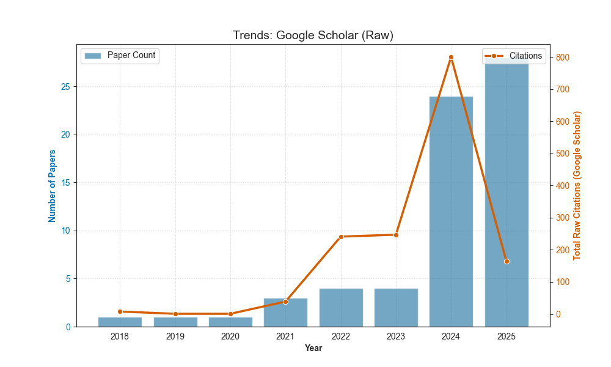
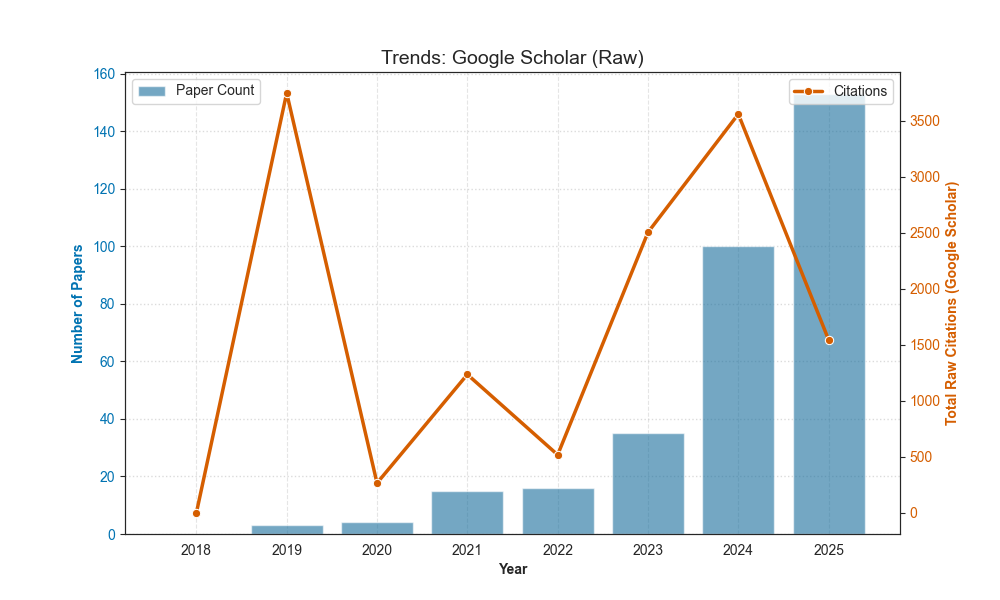
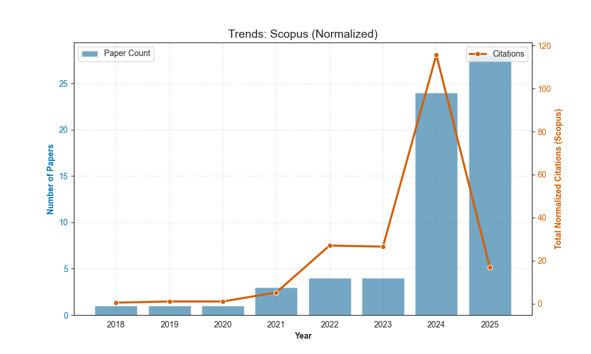
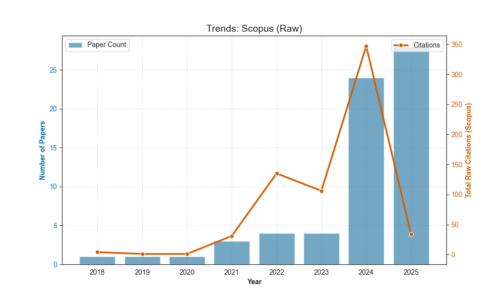
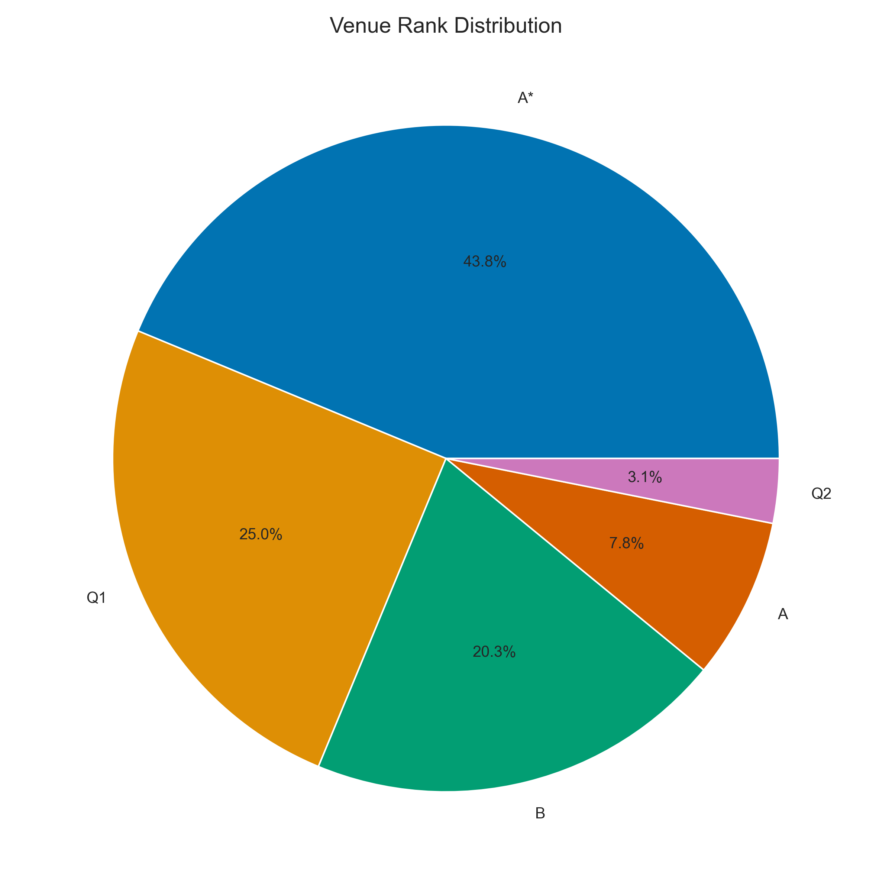
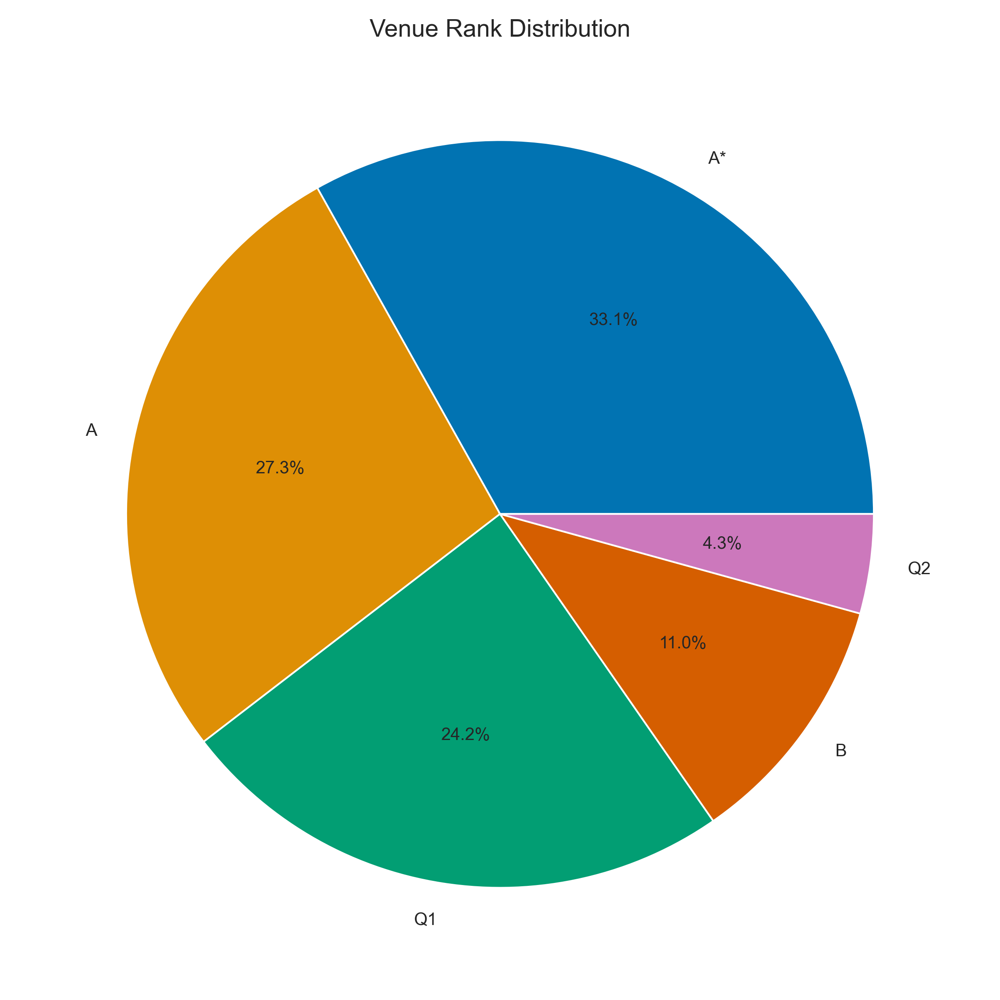

# Supplemental Material

This directory contains supplemental data and analyses that complement our main survey paper. The resources provided here are intended for readers who wish to delve deeper into the data that underpins our conclusions.

## Raw Citation Score Analysis from Google Scholar

While the main paper focuses on age-normalized citation scores to measure the velocity and sustained impact of research, the raw, un-normalized citation data offers a complementary perspective on the absolute influence of papers published in a given year. This section presents the figures and interpretation of these raw scores.

  
  

*Note: On the left we have trends about the IR domain. On the right, what concerns the RSs domain.*

The raw citation data adds nuance to the *tri-partite era* identified in our main analysis, particularly by highlighting the absolute impact of foundational works and the dynamics of the early transitional period.

A key insight revealed with exceptional clarity by the raw data is the dramatic citation peak for RS papers in *2019*. While the normalized score in the main paper identifies this as a period of high-velocity work, the raw score underscores the sheer volume of influence these publications have had. This peak strongly suggests that the work published in this specific year represents a foundational and essential step in the domain, producing cornerstone papers that have become critical references for nearly all subsequent research.

In contrast to the RS trend, the raw citation data for the IR domain reveals a subtle but important difference from the normalized analysis. We observe an initial, slight decrease in raw citation totals for the early years of the LLM era. This trend, which is smoothed out by normalization, may be interpreted as a potential shift in researcher interests. It could signify a brief period where the community pivoted away from older, established IR paradigms without yet fully coalescing around the new LLM-centric ones, temporarily lowering the absolute citation impact of the work produced.

For the most recent years, the behavior of the raw citation score and the normalized citation score is largely identical. This is an expected outcome due to the nature of the normalization metric, as detailed [here](../README.md#normalized-citation-score). For papers published very recently, the denominator of the normalization formula is close to 1. Therefore, the high raw citation counts for this period directly reflect the immediate and significant impact of the latest research, confirming the consecration of the LLM era in both fields.

## Validation Analysis with Scopus Citation Data

### Normalized Citation Score Analysis

To validate the robustness of our findings, we conducted a parallel analysis using citation data sourced exclusively from the Scopus database. Scopus is known for its rigorous indexing and stricter criteria for what constitutes a formal citation compared to broader platforms like Google Scholar. The purpose of this analysis was to determine if the trends observed in our main paper hold under these more conservative conditions.

  
  

*Note: On the left we have trends about the IR domain. On the right, what concerns the RSs domain.*

The analysis of Scopus data provides a strong validation of our primary conclusions. The overall temporal dynamics and the *tri-partite era* identified using Google Scholar data remain remarkably consistent, reinforcing the core thesis of the survey.

The most significant finding is that the overall behavior of the normalized citation trends is virtually identical to that observed with Google Scholar data. Despite the absolute citation counts being quantitatively lower, the key patterns of growth, acceleration, and the consecration of the modern LLM era are preserved. This high degree of consistency under stricter citation criteria lends greater reliability to our analysis. It demonstrates that the identified trends are not artifacts of a single data source but reflect a fundamental and observable shift in the scholarly landscape. This finding further underscores the validity of our conclusions regarding the unification of the two fields.

A minor difference emerges in the early years (*2018*-*2019*) for the IR domain. While the raw Google Scholar data showed a slight decrease in impact, the Scopus data reveals a slow but steady growing interest during this period. This subtle divergence may be attributed to the different types of citations captured by each platform. Scopus, by focusing on peer-reviewed journal and conference publications, may be capturing the steady growth of formal, foundational work in early LLMs for IR, while Google Scholar might have reflected a broader shift in community attention that included pre-prints and workshops. Regardless, this does not alter the overarching narrative of a subsequent, massive acceleration of interest in the field.

### Raw Citation Score Analysis

  
  

*Note: On the left we have trends about the IR domain. On the right, what concerns the RSs domain.*

The raw Scopus data largely reinforces our previous findings but also reveals critical nuances, particularly regarding the impact of foundational work in RS and the publication dynamics in the most recent years.

For the most part, the raw Scopus trend for IR mirrors the patterns observed in other data sources. One subtle but unique deviation is a slight decrease in the raw citation score between *2022* and *2023*. This is a minor fluctuation not present in the other analyses (raw/normalized Scholar, normalized Scopus), where the trend remained constant. This could reflect a momentary lull in the publication of highly-cited works in top-tier, Scopus-indexed venues during that specific period, just before the major surge in *2024*.

The most striking insight from this dataset is the magnitude of the *2019* citation peak for RS. In this highly conservative dataset, the absolute impact of the *2019* foundational papers is far higher than the peak in *2024*. This is a significant deviation from the other analyses, where the *2024* peak was comparable or higher. This strongly suggests that the cornerstone papers from *2019* have an enduring and monumental impact specifically within the formal, peer-reviewed ecosystem.

The relatively lower raw citation count for 2024 in this dataset can be interpreted in two complementary ways:

1. **Stricter Publication Criteria**: It may signify that as the field matured, top-tier, Scopus-indexed venues (e.g., premier journals and conferences) have become more selective. The bar for publishing high-quality, novel work in RS using LLMs may be higher now than in the foundational years, leading to a more deliberate, and perhaps slower, accumulation of landmark papers.

2. **Citation *Lag* in Formal Venues**: There is an inherent citation lag for formal publications. Newer work (from *2024*-*2025*) naturally requires more time to be cited by other Scopus-indexed publications, which themselves have long review and publication cycles. Pre-print citations, which are captured by Google Scholar and can inflate early impact scores, are largely excluded here. Therefore, the lower *2024* peak likely reflects this "formal citation lag" and may rise significantly in the coming years.

In summary, the raw Scopus data provides a final layer of validation and nuance. It confirms the monumental and lasting impact of the 2019 foundational work in RS and suggests that the dynamics of publishing and citation in the most recent, mature phase of the field may be influenced by higher quality bars and the natural delays of the formal peer-review ecosystem.

## Analysis of Publication Venues and Community Trends

Beyond analyzing the content of the research, it is also insightful to examine the publication landscape to understand the scholarly culture and dissemination patterns of the IR and RS communities. This section provides a breakdown of the publication venues for the papers in our survey, categorized by established conference tiers and journal quartiles.

  
  

*Note: On the left we have trends about the IR domain. On the right, what concerns the RSs domain.*

The data reveals distinct and, in some cases, opposite publication strategies between the two fields, highlighting their different community structures and priorities even as their research topics converge.

The IR community demonstrates a strong focus on publishing in the most prestigious venues. A commanding *43%* of the surveyed work appears in top-tier A* conferences, with another *25%* in high-impact Q1 journals. This indicates that the convergence topic is considered central and worthy of the field's premier outlets. A notable characteristic of the IR publication landscape is the preference for B-tier conferences (*20%*) over A-tier conferences (*7.8%*). This suggests that B-tier venues may serve as a crucial and popular outlet for a substantial volume of specialized or incremental work that falls outside the scope of the highly selective A* conferences. The significant portion of work in Q1 journals, combined with the conference publications, points to a relatively balanced ecosystem where both rapid conference dissemination and rigorous journal publication are highly valued.

The RS community shows a pronounced preference for conference publications. The top two categories are A* (*33%*) and A (*27.3%*) conferences, which together account for over 60% of the total output. This points to a scholarly culture that prioritizes the rapid dissemination and discussion of results in major conference settings. Unlike in IR, the RS community follows a more traditional conference hierarchy, with a clear progression from A* to A to B tiers in terms of publication volume. The volume in B conferences (*11%*) is significantly lower than in A-tier venues. While Q1 journals (*24%*) still represent a major and respected outlet, the overall balance is clearly tilted towards the conference track.
